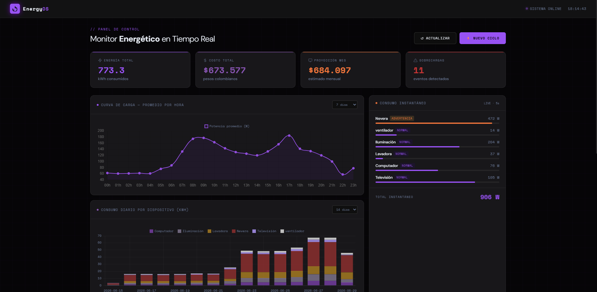
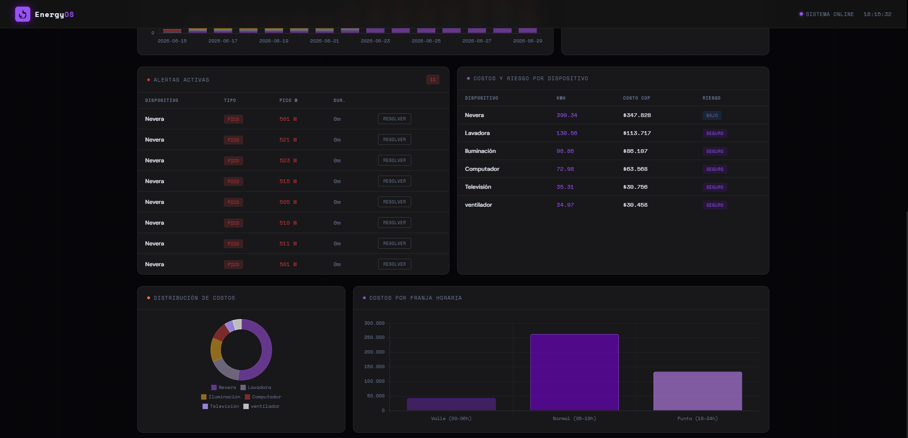

# EnergyPLAY — Sistema de Monitoreo Energético

> Panel de control web para monitorear el consumo eléctrico de dispositivos del hogar en tiempo real, con detección de sobrecargas, análisis de costos y generación de reportes.

---

## Tecnologías utilizadas

| Capa | Tecnología |
|---|---|
| Backend | Python 3.x · Flask · Flask-SQLAlchemy · Flask-Migrate |
| Base de datos | MySQL |
| Frontend | HTML · CSS · JavaScript · Chart.js |
| ORM / Migraciones | SQLAlchemy · Alembic |

---

## Características principales

- **Dashboard en tiempo real** — visualización del consumo instantáneo por dispositivo cada 5 segundos
- **Curva de carga horaria** — promedio de consumo por hora del día (0–23h)
- **Consumo diario por dispositivo** — gráfica de barras apiladas configurable por rango de días
- **Detección de sobrecargas** — alertas automáticas cuando un dispositivo supera su límite seguro
- **Análisis de costos** — cálculo en pesos colombianos (COP) por franja horaria (valle, normal, punta)
- **Proyección mensual** — estimado de gasto basado en el consumo reciente
- **Gestión de alertas** — tabla de eventos con opción de marcar como resuelto

---

## Requisitos previos

Antes de instalar el proyecto asegúrate de tener:

- Python 3.10 o superior
- MySQL 8.0 o superior (corriendo localmente)
- Git

---

## Instalación

### 1. Clonar el repositorio

```bash
git clone https://github.com/Becpo/Python-Energy-Monitor
cd energy-monitor
```

### 2. Crear y activar el entorno virtual

```bash
# Crear entorno virtual
python -m venv .venv

# Activar en Windows
.venv\Scripts\activate

# Activar en Mac / Linux
source .venv/bin/activate
```

### 3. Instalar dependencias

```bash
pip install -r requirements.txt
```

### 4. Configurar variables de entorno

Copia el archivo de ejemplo y completa con tus credenciales de MySQL:

```bash
cp .env.example .env
```

Edita el archivo `.env`:

```
DB_HOST=localhost
DB_PORT=3306
DB_USER=tu_usuario_mysql
DB_PASSWORD=tu_contraseña_mysql
DB_NAME=energy_monitor
```

### 5. Crear la base de datos en MySQL

Abre tu cliente MySQL (Workbench, terminal, etc.) y ejecuta:

```sql
CREATE DATABASE energy_monitor CHARACTER SET utf8mb4 COLLATE utf8mb4_unicode_ci;
```

### 6. Crear las tablas con Flask-Migrate


Si quieres crear de nuevo la carpeta de migraciones ejecuta el siguiente comando:

```bash
flask db init
```

Para preparar las migraciones y comparar los modelos de python con el estado actual de tu base de datos real.

```bash
flask db migrate -m "creacion de tablas"
```
Por último se ejecuta el siguiente comando:

```bash
flask db upgrade
```

Esto creará automáticamente las 5 tablas necesarias: `dispositivos`, `lecturas`, `alertas`, `costos_diarios` y `reportes`.

### 7. Poblar la base de datos con datos de ejemplo

```bash
python -m app.database.db_poblador
```

Este script genera 30 días de lecturas simuladas para todos los dispositivos y las inserta en MySQL. El proceso tarda aproximadamente 5–10 segundos.

---

## Ejecución

```bash
python run.py
```

El servidor Flask se iniciará en `http://localhost:5000`. Abre esa dirección en tu navegador para ver el dashboard.

> **Nota:** el servidor debe estar corriendo para que el dashboard funcione. No cierres la terminal mientras usas la aplicación.

---

## Endpoints de la API

La aplicación expone una API REST que el dashboard consume internamente:

| Método | Endpoint | Descripción |
|---|---|---|
| GET | `/api/health` | Estado del servidor y la base de datos |
| GET | `/api/resumen` | KPIs globales (energía, costo, sobrecargas) |
| GET | `/api/dispositivos?dias=7` | Consumo por dispositivo en los últimos N días |
| GET | `/api/lecturas?horas=24` | Lecturas recientes (filtrables por dispositivo) |
| GET | `/api/alertas` | Alertas activas sin resolver |
| GET | `/api/costos?dias=7` | Costos diarios por franja horaria |
| GET | `/api/perfil-horario?dias=7` | Curva de carga promedio por hora |
| GET | `/api/consumo-diario?dias=14` | Energía total por día y dispositivo |
| GET | `/api/simulacion-tiempo-real` | Lectura instantánea simulada (sin escritura en DB) |
| POST | `/api/generar-reporte` | Genera un nuevo ciclo de datos y lo persiste |
| PUT | `/api/alertas/<id>/resolver` | Marca una alerta como resuelta |

---

## Estructura del proyecto

```
energy-monitor/
├── run.py                      # Punto de entrada del servidor Flask
├── requirements.txt            # Dependencias Python
├── .env.example                # Plantilla de variables de entorno
│
├── app/
│   ├── __init__.py             # Fábrica de la aplicación (create_app)
│   ├── routes.py               # Endpoints de la API REST
│   │
│   ├── database/
│   │   ├── db_conexion.py      # Gestión de conexión MySQL
│   │   ├── db_poblador.py      # Script de carga de datos de ejemplo
│   │   ├── extensions.py       # Instancias de SQLAlchemy y Flask-Migrate
│   │   └── models.py           # Modelos ORM (tablas)
│   │
│   └── services/
│       ├── calculador_costos.py
│       ├── detector_sobrecargas.py
│       ├── generador.py
│       ├── lectura_energetica.py
│       └── motor_analisis.py
│
├── migrations/                 # Migraciones de base de datos (Alembic)
├── static/
│   ├── main.js
│   └── style.css
├── templates/
│   └── dashboard.html
└── tests/
    ├── test_api.py
    └── limpiar_db.py
```

---

## Capturas de pantalla




---

## Autor

**CAMILO ANDRÉS PEDRAZA LEAL**
[LinkedIn](https://www.linkedin.com/in/camilo-pedraza-leal-274b122b1/?skipRedirect=true) · [GitHub](https://github.com/Becpo)

---